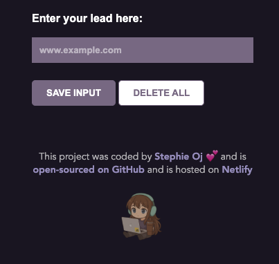

# 🔗 Leads Tracker

---

## 🌐 Live Demo

---

## 🧩 Requirements from the course

- Allow users to **store and retrieve links** easily  
- Save links to a **cloud database using Firebase**  
- Show links in a clickable list  
- Provide an option to **delete all saved leads**  
- Practice **DOM manipulation**, **Firebase integration**, and **JavaScript fundamentals**

---

## 🧠 What I learned

This project helped solidify my understanding of:

- Working with **Firebase Realtime Database** for storing user data  
- Dynamically rendering lists using **JavaScript templates**  
- Creating event listeners for **buttons and input interactions**  
- Using **modular JS functions** to clean up code  
- Styling with **CSS for usability and clarity**  
- Managing **state and UI reactivity** via Firebase event listeners  

---

## 🛠️ Technologies Used

- HTML  
- CSS  
- JavaScript  
- Firebase (Realtime Database)

---

## ⚙️ Features

- ✅ Add and store links to Firebase  
- ✅ Display links as a styled clickable list  
- ✅ Open each saved link in a new tab  
- ✅ Delete all saved leads with a single click  
- ✅ Minimalist, responsive design  
- ✅ Live hosted on Netlify  
- ✅ Clean and accessible markup  

---
## ⚙️ Getting Started

To run this project locally:

1. Clone the repository  
2. Open `index.html` in your browser  
   *(or use a Live Server extension)*
3. To use your own Firebase instance:
  - Replace the Firebase config in index.js
  - Update your Firebase Realtime Database rules

---

## 💬 Feedback

If you have ideas to improve this project — whether in UI, functionality, or code structure — I’d love to hear your thoughts! 🌱

---

## 💜 Happy Coding!

Building tiny tools with big learning impact — one line of code at a time.

---

## 👩🏼‍💻 Author

**Stephie Oj**  
Aspiring Fullstack Developer | Learning in public ✨

